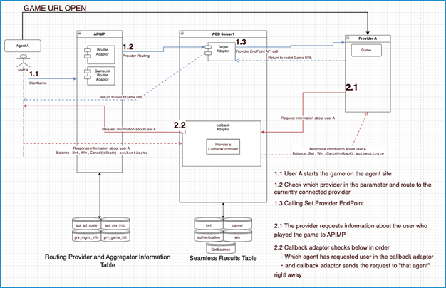

# Overview dự án

## Background

- DKR1 có dự án
- Extend thêm người

## Mục tiêu

- Tổng hợp các nhà cung cấp game (Provider)
  - Người chơi chỉ cần thao tác với 1 Agent
  - Người chơi muốn chơi game gì, nhà cung cấp nào, ... => chỉ cần 1 click

## Mô hình

- Hệ thống là Adaptor, Middleware
- Sử dụng mô hình Enterprise Service Bus
- Là thành phần trọng tâm trong một hệ thống phân tán
- Giúp kết nối các thành phần, ứng dụng với nhau

## Tech stack

- Mapping dữ liệu dùng Map collection của java
- Xử lí các vấn đề tự gọi API trong code như RestTemplate
- Có sử dụng 1 chút query với DB với từng feature (DB là postgres, trong dự án có thể dùng luôn JPA, Native query, …)
- Có sử dụng Redis

## Workflow

1. Nó sẽ là tầng middleware, nhận request từ 1 bên gửi đi
2. Xử lí lại cái request đó
3. Forward request đã chỉnh sửa sang bên muốn nhận
4. Bên muốn nhận khi đã nhận được request thì sẽ có response
5. Bên mình sẽ lại nhận request bên gửi đến và xử lí đó
6. Xử lí xong forward response đã chỉnh sửa đó sang về bên muốn nhận

- Các tác nhận sẽ tham gia vào flow:
	- User sẽ call đến agent 1 request (ví dụ StartGame, get game list, … )
	- Agent sẽ gửi request đó đến con của mình ( là APIMP ): Request này sẽ có format của Agent muốn. (line 1.1)
	- Lúc này APIM sẽ có các service như Route để điều hướng cái request đó về đúng service Adaptor Target sẽ handle (line 1.2)
	- Con target của mình sẽ xử lí request mà agent gửi đến, so cho đúng với format mà bên Provider muốn nhận (line 1.3)
	- Khi provider nhận được request từ mình, họ sẽ xử lí request và response lại cho cái request line 1.3 đúng với format mà provider muốn response
	- Sau khi nhận được response của provider, mình cũng sẽ xử lí lại sao cho đúng format mà agent muốn nhận và response lại đó cho agent.
	- Luồng cuối là callback, đảo ngược lại của luồng trên( thay đổi thứ tự agent <-> provider, con APIMP vẫn ở giữa, nhưng thay vì dùng service Target, sẽ dùng service Callback)

-	Các term của dự án: User, Agent ( nơi tập hợp các game ), Provider (nơi tạo ra các game), ESB (hệ thống chung quản lí các service, luồng, … ), Aggregator (term trên ESB) = Target (Tên service), Callback (term trên cả ESB và Service), Route (Service điều phối request), Adaptor , Middleware, Forward
-	Các tech stack: Map, ESB, RestTemplate, Postgres, JPA, Native query, Redis, Linux comand (sửa/xoá file, restart/kill process)

## Job description

- ReactJS
- Làm trang Back office (Admin)
- Phỏng vấn 100% người Hàn

### Có PO phỏng vấn (50%)
- Hỏi dự án trong CV
- Công nghệ đã làm
- Làm như thế nào
- Non-tech
- Phỏng vấn bằng tiếng Anh

### Phỏng vấn Tech
- Có thể 100% tiếng Hàn
- Hỏi như sách giáo khoa
- Mở rộng thêm 1 chút kinh nghiệm trong dự án
- Có hỏi về review code
- Có comtor tham gia phỏng vấn cùng
- Welcome tiếng Anh

### Test thực tế
- Bài test miệng thực tế
  - Phỏng vấn mindset
- Không có bài test thêm
  - Trong lúc phỏng vấn có bài test

# Hint phỏng vấn

## Giới thiệu

- Trước tiên xin giới thiệu tôi là Đỗ Đức Duy
- Tôi có trên 4 năm kinh nghiệm làm việc Front-end Developer.  
- Tôi đã tham gia nhiều dự án ở các domain khách nhau như bla bla, … 
- Dự án gần đây nhất của tôi là hệ thống abc, với vị trí Front-end Developer. 
- Nhiệm vụ của tôi bao gồm làm detail design, coding và unit test … 
- Tôi sử dụng thành thạo các Java Spring Boot, JSP và các hệ quản trị cơ sở dữ liệu như MySQL, Postgres. 
- Tôi đã được Hiếu training thông tin về dự án và biết được
  - Nó sẽ là 1 hệ thống middleware
  - Đóng vai trò là adaptor để chuyển đổi các request và response từ đối tượng nguồn sao cho phù hợp với đối tượng đích
  - Dự án có sử dụng công nghệ ESB
  - Database là Postgres
  - Cache sẽ dùng Redis
- Tôi sẽ làm công việc chính như:
  - Xử lí công việc theo 2 chiều
  - 1 là chiều từ Agent đẩy request cho Provider và nhận response từ Provider trả về.
  - Công việc này thì sẽ tôi sẽ phải làm hệ thống APIMP có khả năng chuyển đổi request từ agent do user trực tiếp thao tác, sang một request mới mà provider muốn nhận. 
  - Khi provider trả về response thì tôi sẽ phải chuyển đổi response đó  sang đúng format response mà agent muốn nhận. 
  - Để làm được việc này thì tôi sẽ phải điều hướng request bằng Route service, để nó có thể đưa request đến đúng Target service, hay còn gọi là Aggregator, và lúc này Target service sẽ gửi request đến cho Provider và nhận response về , chuyển đối và gửi lại cho agent. 
  - Chiều còn lại là chiều callback, ngược lại với chiều 1, từ Provider sẽ gửi request đến cho Agent và nhận response từ Agent trả về và xử lí tương tự nhưng sẽ bằng Callback service. 
  - Ngoài ra thì tôi sẽ cần phải tự thao tác với server để deploy code, cũng như check lỗi, hoặc sử dụng Postgres để kiểm tra dữ liệu cho chính xác, hay phải tự trao đổi với provider để có thể xử lí được công việc, ..
  - Không biết như vậy có đúng không?
- Rất vui gặp bạn hôm nay

## Trả lời câu hỏi

- Format trả lời thường sẽ từ What => Why => How (it work) => Where (đã sử dụng nó trong dự án nào) => How to (sử dụng nó như thế nào trong dự án đó).

### 1. What?
- Junior
  - Nó là cái gì? Các biến thể, low-levels là gì? 
  - Có những term nào khác cùng stack? 

### 2. Why? 
- Senior
  - Tại sao dùng nó, tại sao nó được sinh ra, nó sinh ra để giải quyết vấn đề gì? 

### 3. How?
- Junior
  - Nó hoạt động như thế nào? 
  - Sử dụng nó như thế nào? 
  - Bằng cách nào?
  - Cần điều kiện gì?
- Middle
  - Có cách dùng khác không?
- Senior
  - So sánh cách triển khai với các term khác.

### 4. Where?
- Junior
  - Đã dùng nó trong ứng dụng nào?
  - Có thể sử dụng nó ở đâu?

### 5. When? 
- Middle
  - Những trường hợp nào thì nên dùng nó? Dùng term khác thay thế khi nào?

### 6. Problem? Solution? 
- SE/TL/SA
  - Khi sử dụng nó thì có những vấn đề gì?
  - Giải pháp cho những vấn đề đó là gì?
  - Best practice trong nền công nghiệp là gì?
  - Nhưng lưu ý khi dùng? …

## Question bank

- Em đã làm những dự án nào
- Giới thiệu dự án đã làm
- Em đã làm gì trong dự án này (miêu tả )
- Tôi thấy bạn có thể làm fullstack, bạn đánh giá năng lực giữa FE và BE của mình như thế nào?
- Postman thì params là gì? Content-type có những giá trị gì? Ý nghĩ của giá trị đó, ví dụ application/xhtml thì response trả về là gì? Có thể thay thế application/json bằng …
- Nói về api naming rule?
- Em có hiểu dự án sắp tới đang làm không?
- Em đã tìm hiểu về dự án của chúng tôi chưa?
- Em biết về ESB không? ( Enterprise Service Buses )
- Mô tả về hệ thống APIM? 
- Em có làm được dự án ESB đó không?
- Phân biệt các http method
- Charactor encoding là gì? vì sao phải dùng nó?
- Nếu gặp vấn đề không thể giải quyết được trong dự án, bạn sẽ làm gì?
- Bạn có thể sử dụng TA trong công việc được không?
- Có thể khách sẽ hỏi block code này có lỗi không, và sửa ở đâu, hoặc block code này đang xử lí cái gì

## Bài test:

Đề bài thì hôm ấy viết trên bảng là cho 1 table Employee bao gồm các trường

{uuid, e_name, e_dept, e_phone, e_address}

FE: Dựng 1 trang List bao gồm cả list, update và delete. Khi nhấn vào 1 row thì hiển thị popup cho phép update.

