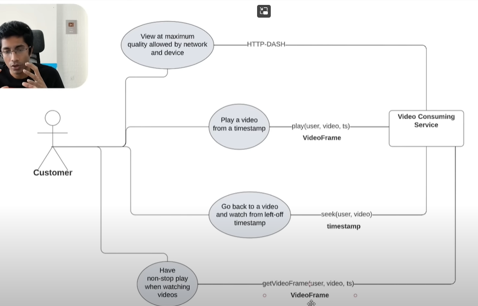

# System Design Concept

### Questions

[1. What are the key design challenges you must solve when building a large-scale distributed system?](./Presale_Requirement_Question.md#system-design-process-1)

[2. In a distributed system, what are the primary reasons for choosing a distributed architecture over a centralized one?](./Presale_Requirement_Question.md#system-design-process-2)

[3. Why are design patterns important in system design, especially for distributed systems?](./Presale_Requirement_Question.md#system-design-process-3)

[4. Can you walk me through the general flow you follow when starting a system design from scratch?](./Presale_Requirement_Question.md#system-design-process-4)

[5. How would you design a system to be fault-tolerant, and why is it critical in distributed systems?](./Presale_Requirement_Question.md#system-design-process-5)

[6. What practices would you apply to make a system easily extensible for future changes?](./Presale_Requirement_Question.md#system-design-process-6)

[7. What aspects would you focus on when testing a newly designed system?](./Presale_Requirement_Question.md#system-design-process-7)

[8. What is a non-functional requirement, and how is it different from a functional requirement?](./Presale_Requirement_Question.md#system-design-process-8)

[9. How do you ensure non-functional requirements are properly addressed during system design?](./Presale_Requirement_Question.md#system-design-process-9)

[10. What strategies would you use to design a fault-tolerant distributed system?](./Developing_Questions.md#system-design-process-10)

## Large scale distributed systems

### Large scale

- Use a lot or intensive in terms (đòi hỏi nhiều) of computer or data or any computer engineering principle
1. Have a lot of data
2. Used by a lot of people
3. Updated frequently
4. A lot of performance expectations

| Pattern                        | What it Means                                              | Why it Helps                                             |
|--------------------------------|------------------------------------------------------------|----------------------------------------------------------|
| Microservices                  | Split backend into small, independent services             | Easier to scale, deploy, and maintain                    |
| Micro-frontends                | Split frontend UI into smaller independent apps            | Scale frontend teams separately                          |
| Load Balancing                 | Distribute traffic across servers                          | Avoid overload and downtime                              |
| Caching                        | Store frequent data closer to users (ex: Redis, CDN)       | Reduce backend/database load                             |
| Database Sharding              | Split database into smaller, faster pieces                 | Handle very large datasets                               |
| Event-Driven Architecture      | Use messaging between components (ex: Kafka, RabbitMQ)     | Decouple systems for scalability and resilience          |
| Replication                    | Duplicate services/databases                               | High availability and fault tolerance                    |
| Auto-scaling                   | Automatically add/remove servers based on traffic          | Save cost and handle unpredictable spikes                |
| Content Delivery Network (CDN) | Cache static content globally                              | Faster delivery, reduces origin server load              |
| Service Mesh                   | Manage secure service-to-service communication (ex: Istio) | Control traffic, retries, failure handling automatically |

### Distributed systems

- The server or the code that is actually executing this program is not in one place.

| Pattern                          | What it Means                                         | Why It’s Used                                         |
|----------------------------------|-------------------------------------------------------|-------------------------------------------------------|
| CDN (Content Delivery Network)   | Distribute static assets closer to users              | Improve latency and reduce server load                |
| Load Balancing                   | Distribute traffic among servers                      | Prevent overload                                      |
| Replication                      | Make copies of data/services                          | Increase availability and reliability                 |
| Sharding                         | Split database into parts                             | Scale data horizontally                               |
| Caching                          | Store frequent data closer to user or app             | Improve speed and reduce server load                  |
| Publish-Subscribe (Event Driven) | Services communicate through events, not direct calls | Decouple components for better scaling                |
| Leader Election                  | Choose a leader among nodes to coordinate tasks       | Manage distributed control (example: master node)     |
| Consensus Algorithms             | Nodes agree on the state (ex: Paxos, Raft)            | Keep system consistent across failures                |
| Data Partitioning                | Divide large datasets into smaller chunks             | Scale storage and retrieval efficiently               |
| Service Discovery                | Services find each other automatically                | Handle dynamic scaling without manual configuration   |
| Heartbeat Monitoring             | Check if services are alive                           | Detect failures early (ex: Kubernetes liveness probe) |

## Design patterns

- A software design pattern is a general, reusable solution to a commonly occurring problem within a given context in software design
- Design patterns are particular practices, principles, or processes which are used by engineers to build these systems.
- Design patterns are common solutions for common problems

### Architectural Design Pattern

- Level: Micro-level (inside each app/component)
- Architectural patterns organize internal code to make apps stable and scalable individually.
1. First, design a good app architecture
2. Use system design patterns to integrate apps/services together	

### System Design Patterns

- Level: Macro-level (across apps/systems)
- System design patterns connect those apps together into a bigger, reliable, distributed system.
- Poor app architecture makes scaling harder even with good system design

## System Design flow

1. Define requirements from the user's perspective.
    - Well document
    - Business banked document
    - Most important feature
2. Reduce these features to data definitions.
    1. Product requirement doc
    2. Features/abstract concepts
    3. Data definitions
    4. Object
    5. Database
3. Endpoint
    - API
    - Router

## Fault Tolerance: Khả năng chịu lỗi

- The system’s ability to keep running even when some parts of it fail (hardware failure, network issue, server crash, etc.).
- Prevent total system downtime when something goes wrong.
- Examples:
    - Load balancers redirect traffic from failed servers to healthy servers.
    - Database replication allows backup database to take over if the primary one fails.
	- Kubernetes automatically restarts crashed containers.

## Extensibility: Khả năng mở rộng

- How easy to add new features or modify the system without breaking existing functionality
- Build systems that can grow and evolve over time.
- Examples:
	- Microservices architecture allows you to add new services without touching old ones.
    - Plugin systems in apps (like Chrome extensions) allow flexible additions.
    - API versioning allows new clients to work with updated server APIs without breaking old clients.

## Testing

- How easily you can add new features or modify the system without breaking existing functionality.
- Build systems that can grow and evolve over time.
- Examples:
	- Microservices architecture allows you to add new services without touching old ones.
	- Plugin systems in apps (like Chrome extensions) allow flexible additions.
	- API versioning allows new clients to work with updated server APIs without breaking old clients.

## Non-functional Requirement

- Non-functional Requirement above Feature of Product
    - Secure
    - Responsive
    - Performance
    - User experience
- Non-functional Requirement can be written in `User Story` with specific acceptance criteria.
- Non-functional Requirement is used to define `Definition of Done`
- Non-functional Requirements have many technical aspects.

# Functional Requirement

## User story

### Questions

[1. In a distributed system with rapidly changing requirements, how would you define and manage user stories to ensure consistent understanding among all team members?](./Presale_Requirement_Question.md#functional-requirement-1)

[2. How do you ensure that acceptance criteria are comprehensive and adaptable when dealing with evolving client requirements?](./Presale_Requirement_Question.md#functional-requirement-2)

[3. What challenges might occur during backlog refinement when sizing user stories, and how would you address them?](./Presale_Requirement_Question.md#functional-requirement-3)

[4. When creating a user story statement, how do you determine the correct level of abstraction to avoid overgeneralization?](./Presale_Requirement_Question.md#functional-requirement-4)

### Concept

- A user story or just story is basically the smallest unit of work
- From the client perspective user stories define project or business functions, and delivered in a particular sprint.
- Represent a software function that is to be developed.
- Is a sub feature or a situation of a Epic.
    - Small step (action) in each Epic (destination of User Journey)
- Explained from perspective of user with **3C** (3 step process) 

1. **C**ard
    - Description of User Story (main idea)
    - **Not** clean features ⇒ free adapt
2. **C**onversation
    - `Card` = brief ⇒ `Point` = reminder ⇒ `What to done`
    - No need detail specification ⇒ Need everyone have same understand
3. **C**onfirmation
    - Acceptance Criteria

### User story statement

- 1 sentence about actions of user
- Capture a description of a software feature from an end-user perspective. 
- User Story statements are short, simple descriptions of a feature from the user's perspective.

----

1. Dựa vào User Journey => Actor => `Who`
2. Với 1 step => nhiều actions => `What`
    - Có thẻ step quá abtract => nhiều trường hợp có thể xảy ra || nhiều actions cần thực hiện => nhiều user story
3. Dựa vào thứ tự của action => Purpose => `Why`

```
As a [Who], 
I want to [What], 
So that I can [Why].
```

### Acceptance Criteria

- Test acceptance
- List of items needed for this story
- Acceptance Criteria is for >= 1 function only
- Describe when an item is completed
    - Create by `Product Owner`
    - Commitment for PBI (a part of it also)
- Release PBI only when it meets "Acceptance Criteria" & "Definition of Done"

### Template

- Story: As a/an `type of user`, I want `some goal`, so that `some reason`
    - User story statement
    - Ex: As a `manager`, I would like to `learn about JIRA` so that `I can use it to manage project susing agile workflows`
- Reason: Background information
    - Reason for User Story - Background of stakeholder
- Acceptance Criteria
    - List of items needed for this story
- Example:
    - Story:
        - As a language learner,
        - I want to practice conversational English with ChatGPT,
        - so that I can improve my fluency and confidence in real-life situations.​
    - Reason:
        - The stakeholder is an English language learner preparing for international travel and job opportunities.
        - They need a convenient and interactive way to practice English conversation without the pressure of real-world interactions.​
    - Acceptance Criteria:
        - Interactive Conversation: ChatGPT can engage in back-and-forth English conversations on various everyday topics.
        - Feedback Mechanism: After each response, ChatGPT provides constructive feedback on grammar and vocabulary usage.
        - Difficulty Levels: Users can select conversation difficulty levels (beginner, intermediate, advanced) to match their proficiency.
        - Session Summaries: At the end of each session, ChatGPT summarizes key vocabulary and phrases learned.
        - Pronunciation Assistance: ChatGPT offers pronunciation guides or links to audio resources for difficult words.

### Process

1. `Product Owner` define 1 Product Backlog Item as User Story
2. `Product Owner` discuss it with `Scrum Team`
    - Make sense the order
    - Get an estimate (sizing)
        -  Estimate (sizing) = a guess effort necessary ⇒ given task
        - ⚠️ NOT commitment || NOT promise => Uncertainty
    - Use `Product Backlog Refinement`
3. Use “planning poker” technique ⇒ explain why & discuss
    - ⚠️ “Planning poker” point = relative sizing
        - NOT absolute meaning
    - Just point of User Story
        - Complex point

### Use case detail

- Test case
- Phát triển từ US statement

- I. Description
    1. Navigation
        - Đường dẫn tới UC đó (link) 
        - Đường dẫn từ User Journey
    2. Design & Diagram
        - Có sẵn Design hoặc Wireframe 
        - Workflow Diagram hoặc cái gì đó có sẵn
    3. Business Rules
        - Validation
    4. Screen's element liên quan
    5. Message, labels, content 

- II. Acceptance Criteria
    - (!) Scenario - Gherkin format
        - Bằng 1 Use case
    1. Given
        - Precondition
        - Các step khác cuối
    2. When
        - Bước cuối
    3. Then
        - Kết quả

## Epic

### Questions

[1. What criteria would you use to decide when a group of user stories should be promoted into an epic?](./Presale_Requirement_Question.md#functional-requirement-5)

[2. How would you create a comprehensive user journey to identify potential gaps for writing complete user stories?](./Presale_Requirement_Question.md#functional-requirement-6)

### Concept

- Epic is large work wanted to do = group PBIs
    - Significant (Đáng kể) in size
    - Doesn't fit in a sprint
- Epic: big milestone (destinatios) in "User Journey" map
- Epic is Specific feature = can't done 1 print => need few sprints
    - Break into many User Story
- ⚠️ Epic not in Product Backlog
    - Group của User stories
    - A big software feature in the product backlog is known as epic.
    - Larger body of work
- 💡 A work is hard to be completed in a sprint - a given iteration.
    - It usually gets broken into multiple user stories.
    - Epics are sub-divided into stories ⇒ `Story = sub-epic`

### User Journey

- 💡 Map of user's path
- Hành trình của 1 end user thực hiện các steps trên ứng dụng

1. Xác định mục tiêu chính
2. Xác định End User

### Example: Language Learner Using ChatGPT

- Step 1: User Journey (Big picture - experience flow)
    1. Learner opens ChatGPT for language practice
    2. Learner selects "Practice English Conversation" mode
    3. Learner chats and receives grammar corrections
    4. Learner finishes session and reviews mistakes and new words
    5. Learner gets suggested exercises for improvement

- Step 2: Epic (Big features supporting that journey)
    - Epic 1: "Interactive Conversation Mode"
    - Epic 2: "Grammar Correction Feature"
    - Epic 3: "Learning Progress Summary and Recommendations"

- Step 3: User Stories (Small specific tasks inside each Epic)
    - Epic 2: "Grammar Correction Feature"
    - As a learner, I want ChatGPT to highlight grammar errors in my messages, so that I can see my mistakes immediately.
    - As a learner, I want ChatGPT to show a corrected version of my sentence, so that I know the right way to express it.
    - As a learner, I want ChatGPT to explain grammar mistakes briefly, so that I can understand and remember the correction.


# High-level Design

### Questions 

[1. Why is analyzing the idea important before starting system design?](./Presale_Requirement_Question.md#high-level-design-1)

[2. What is the purpose of identifying core requirements early?](./Presale_Requirement_Question.md#high-level-design-2)

[3. Why is creating a system diagram important during high-level design?](./Presale_Requirement_Question.md#high-level-design-3)

[4. What are key factors to consider when designing a system’s use cases?](./Presale_Requirement_Question.md#high-level-design-4)

[5. Why is database design crucial for system performance and scalability?](./Presale_Requirement_Question.md#high-level-design-5)

[6. How do you select the right technical solution for a system?](./Presale_Requirement_Question.md#high-level-design-6)

## Concept

- Focus: System architecture overview
- Audience: Architects, senior developers, stakeholders
- View: "Big picture" — systems, modules, how they connect
- Purpose: Plan system structure

-----

- Example: Live Streaming System Design

## 1. Analyzing the Ideas

- Understand the `problem domain`.
- Ask: `What` is the system supposed to achieve?
- Identify: high-level goals, user types, and business needs.
- Avoid thinking about technical solutions too early.

### Example

- Goal: Allow users to broadcast live video and others to view the live feed with minimal delay.
- Target Users: Broadcasters and Viewers.
- Business Need: High availability and minimal latency.

## 2. Summarizing core requirements

- Translate ideas into clear functional requirements.
- Differentiate between Must-have and Nice-to-have features.
- Think in terms of what the system must deliver.

### Example

- Must-have:
    - Streamer can broadcast live video.
    - Viewer can watch live stream with minimal delay.
- Nice-to-have:
    - Support for chat during live stream.
    - Multiple video quality options.

## 3. Diagramming the approaches

- Visualize the core system components and their relationships.
- Focus on data flow, user interactions, and services.
- High-level diagram first, then refine progressively.

### Example

- Diagram basic flow: Broadcaster → Uploads Stream → Streaming Server → Viewer → Receives Stream
- Additional components:
    - Authentication service
    - Chat service (optional)

## 4. Designing workflow (API)

- Define how users interact with the system.
- Each interaction = a Use Case/APIs.
- Focus on input, processing, and output for each API.

------

- Các việc cần làm của hệ thống
- Các bước của nó
- Các vấn đề có thể gặp phải
- Solution có các vấn đề

### Example
- Use Case 1: Start Live Stream
    - Actor: Broadcaster
    - Description: Broadcaster starts a live video session.
    - API: POST /startStream
    - Input: Broadcaster ID, Stream metadata (title, description)
    - Output: Stream URL, Stream ID
- Use Case 2: Watch Live Stream
    - Actor: Viewer
    - Description: Viewer joins and watches a live video stream.
    - API: GET /watchStream
    - Input: Stream ID
    - Output: Video feed stream
- Use Case 3: Send Chat Message
    - Actor: Viewer
    - Description: Viewer sends a chat message during a live stream.
    - API: POST /sendMessage
    - Input: Stream ID, Viewer ID, Message content
    - Output: Success or failure confirmation
- Use Case 4: End Live Stream
    - Actor: Broadcaster
    - Description: Broadcaster ends the live video session.
    - API: POST /endStream
    - Input: Stream ID
    - Output: Stream status updated to "ended"

## 5. Designing Database

- Map out entities based on the requirements.
- Identify relationships (one-to-many, many-to-many).
- Normalize to reduce duplication, but denormalize carefully for performance.

------

- Từ Use case => Object cần cho nó => Database

### Example: Database table

- Users: { user_id, name, role }
- Streams: { stream_id, user_id, start_time, end_time, status }
- Messages: { message_id, stream_id, user_id, content, timestamp }

## 6. Choicing technique solution

- Pick technologies matching system requirements (not trendy tech).
- Consider factors: performance, cost, team expertise, scalability.
- Design for future evolution if possible (extensibility).

### Example

- Video Streaming: Use WebRTC or HLS protocol.
- Backend: Use Node.js with scalable microservices.
- Storage: Use AWS S3 for video storage.

# Low-Level Design

### Questions 

[1. Why is identifying engineering requirements critical before low-level design?](./Presale_Requirement_Question.md#low-level-design-1)

[2. What does a use case diagram help clarify in system design?](./Presale_Requirement_Question.md#low-level-design-2)

[3. Why is service diagram important in low-level design?](./Presale_Requirement_Question.md#low-level-design-3)

[4. What is the purpose of class diagrams in system design?](./Presale_Requirement_Question.md#low-level-design-4)

[5. What value does a sequence diagram add to system design?](./Presale_Requirement_Question.md#low-level-design-5)

## Concept

- Focus: Detailed component design
- Audience: Developers, technical team
- View: "Inside the box" — classes, methods, workflows
- Purpose: Guide real coding and implementation

------

- Take small chunks of the system and you try to elaborate on each chunk.
- Chia nhỏ hệ thống và cụ thể hóa mỗi phần 
- What are the actions that a user can perform
    - Các bước có thể hoạt động
    - Các hành động có thể xảy ra 

## 1. Engineering requirements

- Define non-functional requirements like performance, scalability, latency.
- Set quantitative goals (e.g., "response time < 300ms").
- Focus on technical qualities needed for success.

------

- Mục tiêu chất lượng mà Product cần đàm bảo

### Example

- Streaming latency < 2 seconds
- Support 100,000 concurrent viewers
- Uptime 99.99%
- Secure data transmission (HTTPS, encrypted streams)

## 2. Use case - UML diagram

- Draw a Use Case UML diagram to visualize how users interact with the system.
- Actors = who uses the system; Use cases = actions users can perform.
- Keep it simple and clear.
1. Actor
2. `actor should do` tree
3. Use case diagram
4. Use case document
    - PRD: Product Requirement Document

### Example

- Actors:
    - Broadcaster
    - Viewer
- Use Cases:
    - Start Stream
    - Watch Stream
    - Send Chat Message
    - End Stream

## 3. Service diagram

- Map services/microservices needed for the system.
- Show dependencies between services.
- Define external services (authentication, media server, etc.)
------
1. List service cần thiết
2. List các API tương ứng với mỗi UC từ service



### Example: 

- Service
    - Stream Service (Start/End stream)
    - Viewer Service (Deliver live video)
    - Chat Service (Handle messaging)
    - Auth Service (Authentication)
- Diagram: Arrows showing communication between services and storage (e.g., S3 bucket for video chunks)

## 4. Class UML Diagram

- Break services into classes and objects.
- Define attributes and methods for each class.
- Show relations (inheritance, association, aggregation)
1. Dựa vào Service Diagram => Class diagram (Class Name only)
2. Define action & data (abstract)
3. Define method & property (more detail - optional)

### Example: Classes:

- User
    - Attributes: id, name, role
    - Methods: login(), logout()
Stream
    - Attributes: id, ownerId, status
    - Methods: start(), stop()
- Message
    - Attributes: id, content, senderId, streamId
    - Methods: send()

## 5. Sequence UML Diagram

- Visualize the order of interactions between system components.
- Show time flow from top (start) to bottom (end).
- Focus on one use case at a time (e.g., "Start Streaming").
- Từ UC document + Service diagram => Workflow

### Example: Sequence (for Start Stream)

1. Broadcaster → Auth Service: login request
2. Auth Service → Broadcaster: login success
3. Broadcaster → Stream Service: start stream
4. Stream Service → Database: create stream entry
5. Stream Service → Broadcaster: return stream URL