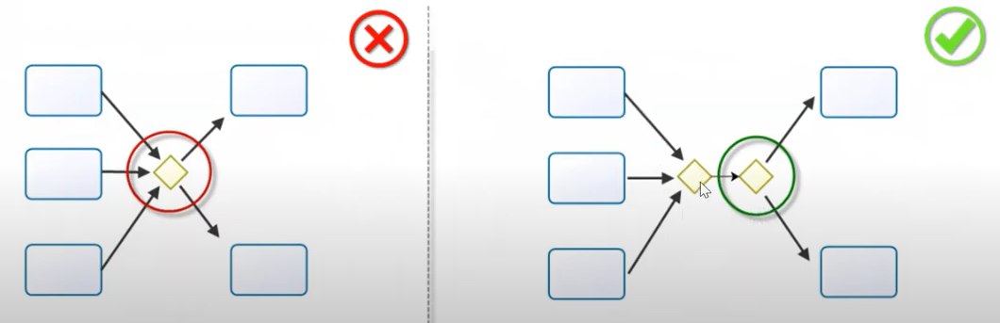
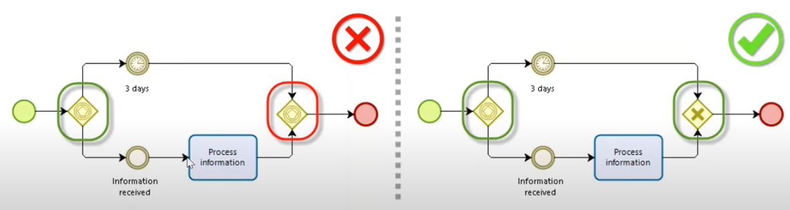
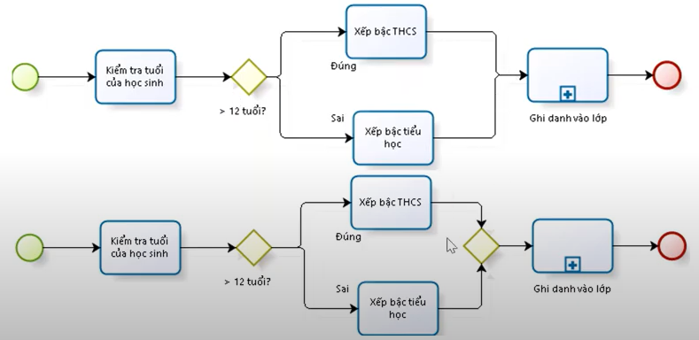
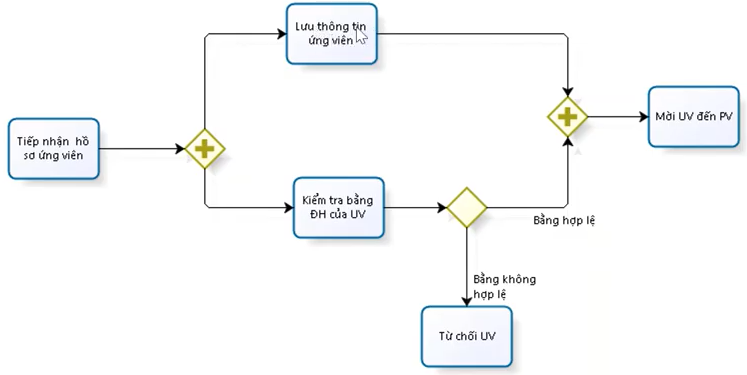
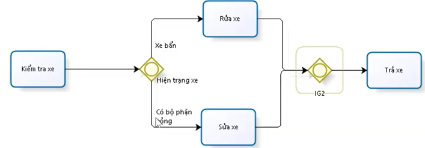
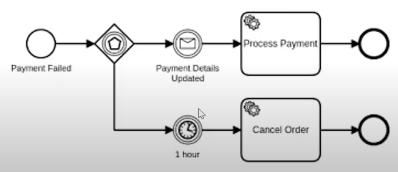
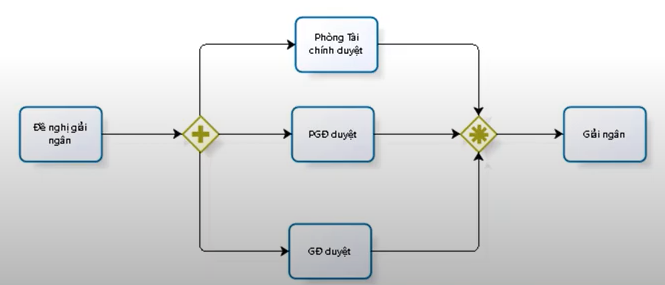

# Flowchart & BPMN

## Flowchart

- Áp dụng cho các quy trình ít phức tạp
- Số lượng Notation hạn chế
- Không thể hiện rõ sự tích hợp giải pháp kỹ thuật vào quy trình nghiệp vụ
- Mô hình hóa ở cấp độ chung chung, có phân biệt hoạt động thủ công hay không
- Nhưng không phân biệt các loại động khác (gửi/nhận thông tin) và cũng không phân biệt các kiểu rẽ nhánh
- Dễ đọc, dễ hiểu

## Business Process Model and Notation (BPMN)

- Áp dụng cho các quy trình phức tạp
- Số lượng Notation phong phú
- Tập trung vào quy trình nghiệp vụ hơn là quy trình xử lý của hệ thống
- Tích hợp giải pháp kĩ thuật với quy trình nghiệp vụ cụ thể
- Mô hình hóa đến mức độ chính xác cao ơn và chi tiết hơn
- Các ký hiệu trong BPMN cho phép thể hiện những thứ như sự kiện liên quan đến thời gian, quy trình lặp lại và trao đổi thông tin.
- BPMN đặc biệt giỏi trong biểu diễn các hoạt động có điều kiện
- BPMN có 1 số kiểu gateway không có sẵ trong các tiêu chuẩn kí hiệu khác
- Người đọc cần được đào tạo

# BPMN Gateway

- Dùng để phân tách và hợp các sequence flow trong quy trình
- ⚠️ Khi rẽ nhành luôn luôn sử dụng gateway, không dùng task
- Dùng cùng một gateway vừa rẽ nhánh vừa hợp nhánh
		- Nên tách làm 2 gateway



- ⚠️ Dùng chính gateway tách nhánh để hợp lại chính các nhánh đó
- Trừ Event-based Gateway thì cần dùng Exclusive Gateway để hợp nhánh



## Exclusive Gateway (XOR)

- Chỉ cho phép 1 nhánh thực hiện
- Phụ thuộc vào điều kiện kiểm tra
- Được biểu diễn bới hình thoi hoặc hình thoi có dấu X


- Cho phép chia luồng nghiệp vụ thành các nhanh dựa theo các điều kiện
- Cũng dùng để hợp các nhánh lại




- 💡 Luôn đặt tên theo câu hỏi
- Luồng hợp nhánh không cần đặt tên

## Parallel Gateway (AND)

- Các nhánh phải cùng xảy ra song song với nhau
- Đồng thời start chứ không đợi nhau
- Được biểu diễn bằng hình thoi với dấu cộng bên trong



- Không cần điều kiện, không cần kiểm tra điều kiện

## Inclusive Gateway (OR)

- Cho phép xảy ra nhiều nhánh
- Chứ không phải 1 nhánh duy nhất
- Có thể nhiều hơn 1 nhánh cùng được thực hiện

```tsx
Inclusive Gateway = Exclusive Gateway + Parallel Gateway
```

- Được biểu diện bởi hình thoi và hình tròn bên trong



- Có kiểm tra nhưng có thể thỏa mãn nhiều điền kiện 1 lúc
- 💡 Nên đặt tên theo câu hỏi
- Mỗi nhánh = kết quả của câu hỏi
- Luồng hợp nhánh không cần đặt tên

## Event-based Gateway

- Cho phép nhánh dựa theo sự kiện
- Luồng xử lý sau khi 1 sự kiện xảy ra
		- Có 1 email đồng ý thì làm gì
		- Quá 30 phút thì xử lý gì
- Được biểu diễn bởi hình thoi với 2 hình tròn và 1 hình ngũ giác bên trong



## Complete Gateway

- Được biểu diễn bởi 1 hình thoi chứa hình hoa thị
- Sử dụng cho các luồng phức tạp và luôn phải có mô tả đi kèm



- Tiền sã được giải ngân nếu được ít nhất 2 - 3 đơn vị/người sau phê duyệt: Phòng tài chính, PGĐ, GĐ duyệt

# BPMN Task

- 1 hoạt động trong luồng quy trình
- 1 hành động thể hiện không thể chia nhỏ hơn nữa
- Mỗi task 1 người thực hiện

## Manual Task

- Do con người tự thực hiện
- Task được thực hiện mà không có bất kì sự hỗ trợ từ ứng dụng IT nào

## User Task

- Task mà người dùng thực hiện trên phần mềm

## Service Task

- Task do hệ thống tự động thực hiện mà không có bất kì tương tác nào với người dùng cuối

## Send Task

- Task thực hiện gửi 1 mesage tới 1 pool hoặc 1 lane khác

## Receive Task

- Task thực hiện đợi 1 mesage từ 1 thành phần khác trong luồng quy trình

## Business Rule Task

- Dùng biểu diễn việc thực thi đồng bộ 1 hoặc nhiều quy tắc
- Cung cấp đầu vào quy tắc nghiệp vụ và sau đó lấy đầu ra do quy tắc nghiệp vụ cung cấp
- Đại diện cho 1 hoặc nhiều quy trình nghiệm vụ bên ngoài
    - Mình chỉ quan tâm tương tác với nó
    - Không quan tâm nghiệp vụ bên trong

## Script Task

- Biểu diễn 1 tập lệnh được thực thi bởi công cụ xử lý nghiệp vụ
- Task hoàn thành khi hoàn thành tập lệnh
- Thường dùng cho IT

# Thành phần cơ bản của BPMN

## Pool

- Thể hiện các tổ chức khác nhau hoặc các quy trình hoàn toàn riêng biệt

### Lane

- Thể hiện các team hoặc cá thể khác nhau trong cùng 1 tổ chức

## Activity

- Mô tả công việc có trong quy trình

### Sub-Processes:

- Activity chứa các Activities khác

## Event

- Sự kiên - xảy ra trong suốt quy trình

### Start Event

- Xảy ra ở đầu quy trình
- 1 vòng tròn nhạt bên ngoài

### End Event

- Xảy ra ở cuối quy trình
- 1 vòng tròn đậm bên ngoài

## Flow

### Sequence flow

- Thứ tự các Activities được thực hiện trong quy trình

### Message flow

- Biểu diễn luồng thông tin giữa các Pool hoặc Lanes với nhau

## BPMN Process

1. Xác định các thành phần tham gia và mức độ chi tiết từng đối tượng
	- Pool
	- Lane
2. Vẽ luồng thành công
3. Bổ sung các chi tiết (type, resources)
4. Các luồng ngoại lệ