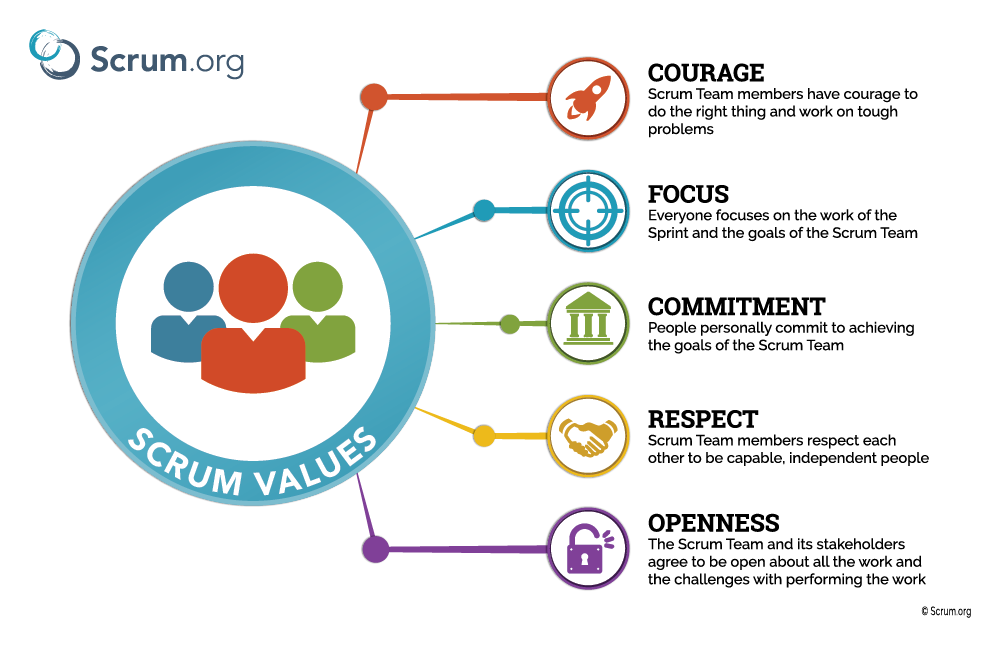

# Scrum Theory

### Questions

[1. Why does Scrum rely on empiricism and lean thinking instead of detailed upfront planning?](./Lead_Questions.md#scrum-theory-1)

[2. How does transparency in Scrum reduce risk and improve decision-making?](./Lead_Questions.md#scrum-theory-2)

[3. What is "emergence" in Scrum and why is it important for handling complex products?](./Lead_Questions.md#scrum-theory-3)

[4. How does emergence affect the way architecture evolves during a Scrum project?](./Lead_Questions.md#scrum-theory-4)

[5. Why is frequent inspection essential in Scrum, and what happens if it’s missing?](./Lead_Questions.md#scrum-theory-5)

[6. Why must Scrum Teams adapt their process or product immediately after detecting a problem?](./Lead_Questions.md#scrum-theory-6)

## Concept

- 💡 Scrum is founded on `empiricism` and `lean thinking`.

- `Empiricism` (chủ nghĩa kinh nghiệm): `knowledge` comes from `experience` and making `decisions` based on `what is observed`.
    - `Empirical` theory: `Process Control Theory` {Q12}
    - `Empirical` data
    - `Empirical` evidence
- `Lean` (tinh gọn) thinking `reduces waste` and `focuses` on the `essentials`(thứ thiết yếu).
- Scrum employs an `Iterative`(lặp lại), `Incremental` (tăng dần) approach to optimize `predictability` and to `control risk`.
- Scrum engages `Scrum Team` `collectively` have `all the skills and expertise`(chuyên môn) to do the work and `share or acquire`(mua lại) such skills as needed.
- Scrum combines 4 formal events into 1 event - the `Sprint`.
    - These events `work` because they implement 3 Scrum `Empirical Pillars` (Trụ cột)

## 1. Transparency (Minh bạch)

- The `emergent` (rõ nét) `process` and `work` must be `visible` to `those performing` the work as well as `those receiving` the work.
	- All stakeholders & `Scrum Team` (who work, process, receive the work) must be visible to performing the work.
		- Everyone shares the same understand.
- `Important decisions` are based on the `perceived state` (trạng thái nhận thức) of its `3 formal artifacts`.
	- Artifacts that have `low transparency` ⇒ `decisions` that `diminish value` (giá trị giảm sút) and `increase risk`.

- 💡 Transparency enables inspection.
	- `Inspection without transparency` is `misleading` and `wasteful`. 

- Trong quá trình phát triển, các thông tin liên quan đến dự án phải được minh bạch và thông suốt.
	- Các thông tin có thể là: mục tiêu dự án, yêu cầu khách hàng, tiến độ công việc, các rào cản khó khăn,...
- Ngoài ra, các yếu tối này cần phải được định nghĩa theo một tiêu chuẩn để người quan sát có thể hiểu những gì họ thấy theo cùng một cách.

### Emergence (sự xuất hiện - release)

- Emergence Infrastructure: cơ sở hạ tầng cho sự xuất hiện
- Emergence Requirements: yêu cầu cho sự xuất hiện
- When handling `complex work`
	- `No` final or `extensive plans`
	- Never final backlog in first sprint

- ⚠️ It makes little sense to create SOMETHING FINAL.
	- When it has LEAST AMOUNT OF INFORMATION

### Emergence Architecture (cấu trúc của sự xuất hiện)

- Emergence = new information
- Process of Emergence: quá trình tạo ra sự xuất hiện = Learning Process
- Architecture = Components and Relations of them.
	- Architecture is emergences after each sprint. {Q14}
	- Sau mỗi Increment (ít nhất là mỗi sprint) ⇒ Architecture thay đổi
- 💡 We design Architecture for current Sprint.

## 2. Inspection (Kiểm thử)

- The `Scrum Artifact` & the `progress` toward agreed goals ⬅️ `inspected` `frequently` & `diligently` (chăm chỉ)
	- Detect `potentially` undesirable `variances` (phương sai) or `problems`.
	- Kiểm duyệt thường xuyên + kĩ lưỡng.
- For `inspection`, Scrum provides in the form of its `5` `Scrum Event`
	- `Scrum Event`  are designed to `provoke change`.
- 💡 Inspection enables adaptation.
	- `Inspection without adaptation` is considered `pointless` (vô nghĩa).
- Các hoạt động trong quá trình thực hiện dự án phải được thường xuyên giám sát và đánh giá tiến độ để phát hiện kịp thời các sự cố không mong muốn.

## 3. Adaptation (Thích ứng)

- `Process` or `Materials` must be `adjusted` (điều chỉnh) when:
	- Any `process aspects`  is `over acceptable limits`
	- `Resulting product` is `unacceptable`
- The `adjustment` must be made `as soon as possible` to `minimize further deviation`.
- `Adaptation` becomes more `difficult` when the `people` involved are **`NOT`** `empowered` or `self-managing`.
	- `Scrum Team` is expected to `adapt` the moment it `learns anything new through inspection`.
- Thích nghi trong bối cảnh này chính là phải liên tục phát triển.
- Các sự điều chỉnh cần phải được thực hiện ngay khi có thể để giảm thiểu tối đa các vấn đề cũng như sự sai lệch của dự án.

# Scrum Values

### Questions

[1. Why is courage essential for Scrum Team success, especially under pressure?](./Lead_Questions.md#scrum-theory-7)

[2. How does focus help a Scrum Team achieve Sprint and Product Goals more effectively?](./Lead_Questions.md#scrum-theory-8)

[3. What does commitment mean in Scrum, and how does it affect team reliability?](./Lead_Questions.md#scrum-theory-9)

[4. How does mutual respect among Scrum Team members improve collaboration?](./Lead_Questions.md#scrum-theory-10)

[5. Why is openness critical for inspecting and adapting work in Scrum?](./Lead_Questions.md#scrum-theory-11)

## Concept

- Successful use of Scrum = `Scrum Team` is `proficient` (thành thạo) in `5 values`.
    - 💡 Scrum team has truth (on themselves and stakeholders)
	- All scrum values are impacted by a lack of trust.	
- These `values` give `direction` to the `Scrum Team` ⇒ their work, actions, and behavior.
	- Made decisions, steps taken, used way of Scrum is should reinforce these values, not diminish or undermine them.
- `Scrum Team members` learn and explore the `values` as they work with `Scrum Event` and `Scrum Artifact`

## 1. Courage (Can đảm)

- The Scrum Team members have the `courage to do the right thing`, to work on tough problems.
		- Mỗi thành viên cam kết với các thành viên khác về những điều mình làm & công việc đã được chọn ở buổi lập kế hoạch Sprint.

## 2. Focus (Tập trung)

- Their `primary focus` is on the work of the Sprint to make the best possible progress `toward these goals.`
	- Mọi người tập trung vào công việc của Sprint & Mục tiêu Sprint của Nhóm.
- Scrum encourages a `sustainable pace` (tốc độ bền vững) for the `development effort`.
    - They do their best to reach the Sprint Goal.
    - They work as professionals to best achieve goals.
    - They are dedicated to improving their skills and helping each other.

## 3. Commitment (Cam kết)

- The Scrum Team `commits` to `achieving its goals` and to `supporting each other`.
    - Mọi thứ cần được cởi mở để các thành viên trong team có thể nắm bắt được công việc cũng như hiểu hết các vấn đề khó khăn đang gặp phải.
    - Nếu mọi người không cởi mở với nhau, thông tin bị che giấu rất nhiều và hiệu quả công việc khó lòng có thể nâng cao.

- 💡 Work to identify and add any usability criteria to the Definition of Done.

- Make sure that every Product Increment adherents to the Definition of Done.

## 4. Respect (Tôn trọng)

- Scrum Team members `respect each other` to be capable, `independent people`, and are respected as such by the people with whom they work.
    - Các thành viên trong team cần phải tôn trọng lẫn nhau, giúp nhau trở nên tốt hơn và có thể độc lập hoàn thành công việc của mình.

## 5. Openness (Cởi mở)

- `Scrum Team` and `Stakeholders` are `open` about the `work` and the `challenges`.
    - Thành viên trong team cần có sự can đảm để làm điều đúng đắn cũng như làm việc trong điều kiện khó khăn.

# Scrum Artifact

### Questions

[1. How do Scrum Artifacts maximize transparency and support empirical decision-making?](./Lead_Questions.md#scrum-theory-12)

## Concept

- Scrum’s artifacts represent `work or value`.
    - `Maximize transparency` of key information.
    - Everyone `inspecting them` has the `same basis for adaptation`.
- Artifact in `Archeology` = something made by human
    - In Scrum, this is something made by `Scrum Team`
- Each artifact contains a `commitment`
    - Ensure `information` be `transparency` and `focus` against `measured progress`
    - Commitment = dedication to achieving ⇒ what & why ⇒ specific result
    - `Product Backlog` ⇒ Product Goal.
    - `Sprint Backlog` ⇒ the Sprint Goal.
    - `Product Increment` ⇒ `Definition of Done`.
- `Important decisions` are based on the `perceived state` of its `3` formal `artifacts`.
    - Commitments exist to reinforce `empiricism` and `Scrum values` for `Scrum Team` and their `Stakeholders`.
- Scrum Users must `frequently inspect Scrum Artifacts` and progress toward a Sprint Goal to `detect undesirable variances`.
    - Their inspection `should not be so frequent` that inspection `gets in the way of the work` (cản trở công việc)

# Product Backlog

### Questions

[1. Why is the Product Backlog considered an emergent artifact, and how does that affect product development?](./Lead_Questions.md#product-backlog-1)

[2. Why must each Product Backlog Item be clear enough before Sprint Planning?](./Lead_Questions.md#product-backlog-2)

[3. How does proper ordering of PBIs by the Product Owner maximize product value?](./Lead_Questions.md#product-backlog-3)

[4. Why is it critical that Developers own the sizing of Product Backlog Items?](./Lead_Questions.md#product-backlog-5)

[5. What risks arise if the Product Owner does not actively manage the Product Backlog?](./Lead_Questions.md#product-backlog-5)

[6. How does having a clear Product Goal improve Scrum Team alignment and focus?](./Lead_Questions.md#product-backlog-6)

[7. Why is story point estimation based on relative sizing instead of absolute time?](./Lead_Questions.md#product-backlog-7)

[8. Why is continuous Product Backlog Refinement critical for Sprint success?](./Lead_Questions.md#product-backlog-8)

## Concept

- 💡 `Product Backlog` = Commitment => `Product Goal`
- `Product Backlog` is an `emergent`(rõ nét), `ordered list` of what is needed to `improve the product`.
    - `Accumulation` (sự cộng dồn) of `Unfinished Work`
    1. To-do list (can have random order)
    2. Analysis result (risk) when organize order
    3. Order to make things forward → close to goal
    4. Confuse 1 milestone
        - Transparency kick in ⇒ break milestone = shippable enough
- It is the `single source` of work for `Scrum Team`
    - Single source of requirements for `any changes of Product`
- `Product Backlog` present `transparency`
    - If it is `outdated` or `unclear` ⇒ `Scrum Team`, `Stakeholder`, `Organization` are `impacted`
- 💡  Product Backlog is `NOT baselined` in Scrum.

## Product Backlog Item (PBI)

- Issue `needed to Product`
    - Feature
    - Improvement
    - Fix bug
- Product Backlog items `ready for selection` in `Sprint Planning`
    - Can be `Done` by the `Scrum Team` within that `Sprint`.
    - Acquire `degree of transparency` after `refining` activities.
  	- 💡 `Developer` pull work

- Property
    - Description
    - Order
    - Size
    - Value
    - Acceptance criteria (for testing)
- `Product Owner` mainly manage PBI
    - `Developer` can write description of PBI
- ⚠️ `User Story` = 1 template of PBI, not all

### PBI order

- 💡 `Product Owner` decides PBI order
- Aspects = `suggest` ⇒  `Product Owner`

- Ensuring that `most valuable functionality` is produced `first`
- Aspects
	- Sizing
	- Value
	- Relation with other PBI (dependency)

### PBI sizing

- Sizing (estimation) = define size/effort of PBI
- `Developer` responsible for size of PBI
    - `Product Owner` may influence the Developers
    - `Product Owner` & `Developer` understand items by trade off (cân đối)

### Product Backlog Management

- 💡 `Product Owner` mainly manage Product Backlog
- `Product Owner` manages Backlog = list PBIs
- Even `Product Owner` collaborate with `Stakeholder` & `Scrum Team`
- 2 others don’t  manage Product Backlog

1. `Product Owner` collaborate `Stakeholders`
    - Try to `understand Business Requirement`
    - `Find expectation` for that Business
2. `Product Owner` defines `Product Goal`
    1. Start with few ideas (nothing detailed)
    2. List some features (small as possible)
3. Create `PBIs` that `only` reach `Product Goal`
    - Use `User Story` template to describe PBI as story
    - Short descriptions of feature
4. `Product Owner` manages PBIs `any times`
5. PBI = ready when enough: `Small` & `Detailed` & `Actionable`
6. Start first sprint without completing
    - Pick top PBIs ⇒ `Sprint Backlog`

- ⚠️ Scrum Guide doesn’t limit time to manage Product Backlog

## Product Goal

- `Product Goal` describes a `future state` of the product which can serve as a `target` for `Scrum Team` to plan against.

- ⚠️ The Product Goal is in the Product Backlog.
- The rest of the Product Backlog emerges to define `what` will `fulfill` the `Product Goal`.

- A product is a `vehicle` to `deliver value`.
    - It has a `clear boundary`, `known stakeholders`, well-defined `users` or `customers`.
    - A product could be a `service`, a `physical product`, or `something more abstract`.
- Product Goal is the `long-term objective` for the `Scrum Team`.
    - `No` Goals runed in `parallel`.
        - No Goals competed for attention.
    - They must `fulfill` (or abandon) `1 objective` `before` taking on the `next`.

- 💡 1 Product Goal per time - anytime
- Don’t run multiple Product Goal at the same time
- A goal give a direction ⇒ focus 1 thing
- Import steps toward ⇒ vision

### Vision (ambitious)

- Know without how
- Can be broken into `clear` & `achievable` & `small` goal

- 💡 Product vision = overall goals

- Not from Scrum Guide

## Story point

- Story point estimation is basically done where estimates are made relative to the smallest component or item with the known level of difficulty.
- `Team Velocity`: how many story points team can complete in a sprint.
	- Use this metric to predict how many story points they're going to be able to fit in the next sprint.

## Product Backlog Refinement

- `Breaking down` + `Further defining` (define hơn nữa) `Product Backlog` items => `smaller` more precise (chính xác) items.
    - An ongoing activity to `add details`: `description`, `order`, and `size`.
- Meeting to `clarify PBI` for `upcoming sprints` (unknown future)
    - Define more detail to PBI
    - Repair PBI to `clear enough` to `plan` and `execute`
- `Scrum Team` spend as much `time as needed` to ensure that items at the `top of the Product Backlog` are `ready` for selection in the upcoming Sprint
    - `Scrum Team` `decides` when (and how) `refinement is done`, not only Product Owner.
    - It is a `collaborative work`.
    - Not more than `10% effort`
    - `Developers` & `Product Owner` who is still accountable for it.
- Notice something `wrong` || `unclear` ⇒ Change `Product Backlog`
    - Adaptation = continuously improve
- 💡  Product Backlog = never complete & constantly changing

# Sprint Backlog

### Questions

[1. Why is the Sprint Backlog considered a living plan, and how does it support the Sprint Goal?](./Lead_Questions.md#sprint-backlog-1)

[2. How does having a Sprint Goal create flexibility in how the Scrum Team completes Sprint work?](./Lead_Questions.md#sprint-backlog-2)

[3. Why are Developers solely responsible for managing the Sprint Backlog, and not the Product Owner?](./Lead_Questions.md#sprint-backlog-3)

[4. What steps must Developers follow to create and update a meaningful Sprint Backlog?](./Lead_Questions.md#sprint-backlog-4)

[5. Why can the Sprint Scope be adjusted during the Sprint without changing the Sprint Goal?](./Lead_Questions.md#sprint-backlog-5)

## Concept

- 💡 `Sprint Backlog` = `Sprint Goal` + `Top PBIs` + `Plan for delivering`

- The Sprint Backlog is `composed` (bao gồm) of the `Sprint Goal` (`WHY`)
    - The set of `Product Backlog` `items selected` for the Sprint (`WHAT`)
    - An `actionable plan for delivering` `Product Increment`  (`HOW`).
- Sprint Backlog includes:
    - `WHY`: Sprint Goal
    - `WHAT`: Selected PBI
    - `HOW`: Plan
- Sprint Backlog is a plan `by & for` the `Developer`.
    - It is a `highly visible`, `real-time` picture of the work that Developers plan to accomplish during the Sprint in order to achieve the Sprint Goal.
- Sprint Backlog is `created during` `Sprint Planning`
- Sprint Backlog is `updated throughout` `Sprint`.
    - It should have `enough detail` that they can `inspect their progress` in `Daily Scrum`

- ⚠️ `NOT` commitment || promise

## Sprint Goal

- Sprint Goal is the `single objective` for `Sprint`.
- Sprint Goal is a `commitment` by `Developer`
    - It provides `flexibility in terms` of the exact work `needed to achieve it`.
- The Sprint Goal is `created` during `Sprint Planning`
    - Added to the Sprint Backlog

## Person in Charge

- `Developer` responsible for `Sprint Backlog`
    - `Product Owner` `can't change`
        - `Product Owner` only `collaborate` with `Developer` and suggest.
    - Sprint Backlog selected by `Developer` = selected PBI
- `Developer modify` Sprint Backlog `during` `Sprint`
    - `Add new` work (task) in `if necessary`.
    - `New work` or further decomposition of work `added as soon as possible` after they are identified.
- Developers `keep` the `Sprint Goal` in `mind`
- `Work` turns out to be `different` than Developers `expected`
    - Developers `collaborate` with `Product Owner` to `negotiate` (dàn xếp) `Sprint scope`.
    - `Without affecting` the Sprint `Goal`.

## Process

1. Define `Sprint Goal`
2. Select `TOP` Product Backlog Item => Sprint Backlog ⇒ achieve `Sprint Goal`
3. Plan `Product Increment`  (release) & Sprint Plan
	- ⚠️ **All** Sprint Backlog Item (SBI) = Product Backlog Item (from Product Backlog)
	- A plan = Decomposition (sự phân ly) PBI ⇒ small work (task)
	- `Developer` bases on to build `Product Increment`.
4. Incomplete PBIs `move back to Product Backlog`
    - They `may be` estimated and added to `Sprint Backlog of the next Sprint`, so it `doesn't mess up Product Backlog`.
    - Work can `only` be `done` or `not done` right before `Sprint Review`
        - Incomplete work has value as it is `NOT` releasable.
        - `NOT` part of `Product Increment` .
        - `NOT` demonstrated during `Sprint Review`.
        - `NOT`  automatically go to next Sprint.
    - `Product Owner`  will decide them for future sprint.

## Sprint Scope

- Sprint Scope = Scope of Sprint Backlog    
	- 💡 Amount work in that Sprint
	- `Functionality` developed in that Sprint
- `Developer` & `Product Owner` can `renegotiate` (đàm phán) Sprint Scope `anytime`
	- ⚠️ `BUT` Sprint Goal can't be changed
	- Ex: Goal = "Have a clean place"
	- Scope = `What want in to done?` & `extend of work`
- `Sprint Backlog` can be `changed` to `fit Sprint Goal` when `changing Scope` of Sprint.
	- Scope of Sprint is `flexible`
	- Scope is `changed` (reduced || extended) based on `reality` and `plan`
		- Reduce not relative work with Sprint Goal
- ⚠️ Don't plan Sprint Backlog only for Sprint Goal
- Let Sprint Backlog can be flexible during Sprint
- `Don't` let `Sprint Goal` fill `almost Sprint Backlog`
    - It's hard to balance between keeping Sprint Goal and flexible
    - Not always possibly Sprint Backlog focus only Sprint Goal

- Giảm thiểu việc "cố đấm ăn xôi" với sprint goal

# Product Increment

### Questions

[1. Why is the Product Increment considered a concrete stepping stone toward the Product Goal?](./Lead_Questions.md#product-increment-1)

[2. What is the basic process to create a Product Increment during a Sprint?](./Lead_Questions.md#product-increment-2)

[3. Why is creating at least one Product Increment per Sprint critical, even if it is not released immediately?](./Lead_Questions.md#product-increment-3)

[4. What factors should the Product Owner and Scrum Team consider when deciding to release a Product Increment?](./Lead_Questions.md#product-increment-4)

## Concept

- An Increment is a `concrete stepping stone` (bước đệm cụ thể) toward `Product Goal`.
- 💡 A new version of Product

- Each Increment is `additive` (bổ sung) to `all prior` (trước đó) Increments.
    - All Increments are `verified`, ensuring `work together`.
- In order to `provide value`, Increment `must be usable`.
- Increment là tổng hợp tất cả các product backlog được hoàn thiện trong suốt một sprint và giá trị tăng trưởng của tất cả các sprints trước đó.

## Process for Increment

### 1. Create Increment

- 💡 `Multiple` Increments may be `created` within a `Sprint`.
- The `sum of Increments` is presented at `Sprint Review` thus supporting `empiricism`.
- `Scrum Team` create ≥ 1 Increment per `Sprint`
- `NOT` mandatory to deploy it

- `CREATING` does `NOT` mean `RELEASTING`
    - `CREATING` isn't shipped into End User
- `Work` can `NOT` be considered part of an `Increment` `unless` it `meets` the `Definition of Done`.
    - Increment is created `as soon as` a Product Backlog` Item meets `Definition of Done`.
    - Increment is `done` when `everyone` knows `what done` mean

## 2. Release Increment

- `Product Owner` make `end decision` ⇒ `if & when` release Increment.
	- In agreement with the rest of `Scrum Team`.
	- Product Increment is released `when it makes sense`
- An Increment may be `delivered to Stakeholders` prior to the `end of Sprint`.

- 💡 Increment can be released `anytime` during the Sprint

- `Sprint Review` should `NEVER` be considered a `gate to releasing value`.

# Definition of Done

- A `formal description` of the `state of Increment` when it `meets` the `quality measures required` for the product.
	- It specifies `what` it means for the `Increment` to be `complete` and `releasable`.
	- The moment a `Product Backlog item` `meets` the `Definition of Done`, an `Increment is born`.
- Definition of Done creates `transparency` by providing `everyone shared understanding of what work was completed` as `part of Increment`.
	- Definition of Done `ensures artifact transparency`
	- Definition of Done accounts to `forecast for Sprint` => impact quality of Increment.
	- Definition of Done = checklist (convention) for function & non-function
	- 💡 Coding convention

- If a `Product Backlog item` does `NOT` meet `Definition of Done`
	- It `cannot` be `released` or even `presented at the Sprint Review`.
	- It `returns` to the `Product Backlog` for `future` consideration
- Definition of Done should have `strict criteria for higher quality`
- `For Common`, not particular function
    - Apply for every PBI and Increment
    - Commitment for Increment
- ⚠️ Mandatory in Scrum
	- Finish 1 PBI + Pass "Definition of Done" => Can have 1 Product Increment

## Process

### Create “Definition of Done”

- Definition of Done is created by both `Organization` and `Scrum Team`.
- 💡 Scrum Guide doesn't create any specific rule for it.

- Definition of Done is `part of standards` of the `organization`, all `Scrum Teams` must `follow it as a minimum`.
    - Not an organizational standard, Scrum Team must create Definition of Done `appropriate for the product`.
    - `Created` by `Organization` or `Scrum Team` if `none` was created by `organization`.
- Definition of Done is created in `anytime` in `1st` `Sprint`
    - Everybody must `understand what "done" means.`
    - `RECOMMEND` should created in `1st` `Sprint Planning`.
- Discussion during whole process

### Update “Definition of Done”

- Definition of Done can be `changed` during `Sprint`
	- `Sprint Retrospective` is used for `imspecting` and `adapting` Definition of Done.
	- 💡 Scrum Guide just recommends for more clearer
	- Sprint retrospective = how increase product quality
- 💡 Not always have the final

## Scrum Team

- `Multiple Scrum Teams` working together on a product, they must mutually define and `comply with same Definition of Done`.

### Scrum Master

- `Observe over time` in regard to Definition of Done {Q10}
    - `Definition of Done` will `grow in size` as the quality of the `Product increases`
- `Handle disagreement` within `Scrum Team` in regard to the Definition of Done.
    - `Bring` the team `together` and `facilitate a solution`.

### Developer

- Developers are `required` to `conform` to the `Definition of Done`.
	- Make sure that `every Product Increment` adherents to the Definition of Done.
- Developers `identify` and `add` any standards/rules to `Definition of Done`
- During `Sprint Planning`, Developers take into `consideration` the `Definition of Done` when `creating` the `Sprint forecast`.
	- `How many` PBIs is `selected`

- 💡 If something is over to Developer, for transparency, reduce Definition of Done to useful enough {Q12}
	- It is better to have a lower quality standard than no standard at all.
