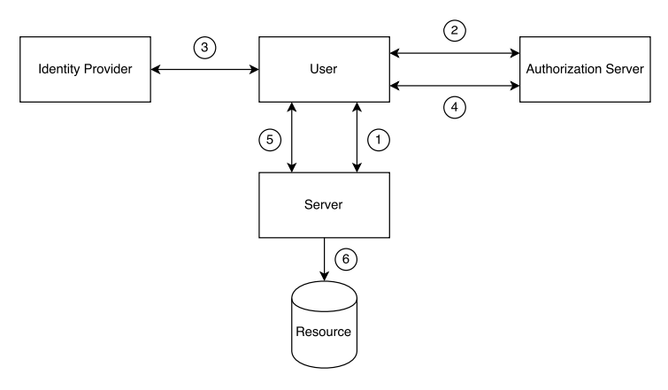

# JSON Web Token (JWT)

Category: Security
Refrence: Untitled (https://www.notion.so/0187168a16a1443cb669cd6deed90c1e?pvs=21)

# Vocabulary

[Compact](https://www.notion.so/Compact-f998e07b1e6f4893aab5c353788b2ce4?pvs=21) 

[Claim](https://www.notion.so/Claim-c61e2f3faa7d42c1926f65a4f939bb28?pvs=21) 

[Tamper](https://www.notion.so/Tamper-488b1308fb2c452a8303a5cadd0b3751?pvs=21) 

[Privacy](https://www.notion.so/Privacy-66fd0cf9a2834f80ae53be141ad1845e?pvs=21) 

[Concern](https://www.notion.so/Concern-ba26d00b68df450cb93843067d2456c4?pvs=21) 

[Appropriate](https://www.notion.so/Appropriate-98fe10ec27e7476185102235d982a655?pvs=21) 

[Consideration](https://www.notion.so/Consideration-6faaef9b186d4381bf47649786102c8f?pvs=21) 

[Strip](https://www.notion.so/Strip-6d4e70710bff4b8d8d68b4c947392963?pvs=21) 

[(*) Separate](https://www.notion.so/Separate-e6a1e0ccc90043baa0ccd95972e41dee?pvs=21) 

[Permanent](https://www.notion.so/Permanent-c578fe65caee4074aec0bb47327ca3be?pvs=21) 

[Reflect](https://www.notion.so/Reflect-d459d2d5596e4971b01e7d3fcba542c7?pvs=21) 

[Federate](https://www.notion.so/Federate-05406ab2960a4f81967d1996700f7807?pvs=21) 

‣ 

[Authenticity](https://www.notion.so/Authenticity-edce5374acb047ae82f827645e7542a8?pvs=21) 

[Latency](https://www.notion.so/Latency-ff4a848c03404355ad657bd906394b6b?pvs=21) 

[Algorithm](https://www.notion.so/Algorithm-8ffd68cfc536419b8c47a8a5edad0f78?pvs=21) 

[Associate](https://www.notion.so/Associate-7b6b94a7e82a4266ab6e2c09d1dfbcca?pvs=21) 

[Additional](https://www.notion.so/Additional-23c18c298b334434aaa5dd066da45809?pvs=21) 

[Authorization](https://www.notion.so/Authorization-e634f41029ce4ed8b48f108a1612d131?pvs=21) 

---

# Basic

## Concept

- Authenticate token but also includes user and session data.
- It is a series of claims
    - It is actually a very compact, printable representation of a series of claims
    - Along with a signature to verify its authenticity
    - Claims are definitions or assertions made about a certain party or object.
    - Some claims are defined as part of the JWT spec.
    - Others are user defined.
- Signed JWTs are constructed from three different parts.
    - They are encoded separately.

### Header

- Contains data and algorithm to encrypt JWT string.

### Payload

- Data is stored inside token with JSON format

### Signature

- Secret key to verify JWT

## Problem does it solve

- The main purpose of JWTs is to transfer claims between two parties
    - The most important aspect of this is the standardization effort in the form of a simple, optionally validated and/or encrypted, container format.
- Some of these applications include:
    - Authentication
    - Authorization
    - Federated identity
    
    <aside>
    💡 Client-side sessions (“stateless” sessions)
    
    </aside>
    
    - Client-side secrets

# Federated identity

- Federated identity systems allow different, possibly unrelated, parties to share authentication and authorization services with other parties.

1. The user attempts to access a resource controlled by a server.
2. The user does not have the proper credentials to access the resource, so the server redirects the user to the authorization server. The authorization server is configured to let users log-in using the credentials managed by an identity provider.
3. The user gets redirected by the authorization server to the identity’s provider log-in screen.
4. The user logs-in successfully and gets redirected to the authorization server. The authorization server uses the credentials provided by the identity provider to access the credentials required by the resource server.
5. The user gets redirected to the resource server by the authorization server. The request now has the correct credentials required to access the resource.
6. The user gets access to the resource successfully
- All the data passed from server to server flows through the user by being embedded in the redirection requests (usually as part of the URL).
- This solution is the possibility of making access tokens easy to validate.

## Access Token

- Access token is token that give those who have them access to protected resources.
- This token is usually short-lived.
- With JWT, there is no need to contact the authorization server.
    - It has an expiration date embedded in them.
    - It also carry or be associated with additional information.
    - And carries a signature may be validated by the resource server on its own.
- Appropriate security in case of token leaks
- We make access tokens as short-lived as possible and embedding additional checks (such as client checks) into them.

---

- Access token là mã trao quyền truy cập tới API, các tài nguyền cần bảo mật
- Nó có thời gian tồn tại giới hạn
- Access token bao gồm 1 signature để BE kiểm tra hợp lệ

## Refresh (reset) tokens

- This token allows clients to automatically request new access tokens.
- After an access token has expired, a client may perform a request for a new access token to the authorization server.
- By keeping validation separate from queries to the authorization server
    - Better latency
    - Less complex access patterns as possible.
- Refresh tokens, by virtue of being long-lived, must be protected from leaks.

# Security Considerations

## Client-side/Stateless Session

- Stateless sessions are in fact nothing more than client-side data.
- Key is generated by the use of signing and possibly encryption to authenticate and protect the contents of the session
    - Signatures are useful to validate the data against tampering.
    - Encryption is useful to protect the data from being read by third parties.
    - Data is stored in key
- Most of the time sessions need only be signed.
    - No security or privacy concern when data stored in them is read by third parties.
    - The subject claim usually identifies one of the parties to the other.
        - Think of user IDs or emails
        - It is not a requirement that this claim be unique. (It means not only 1 claim is unique, user can be identify by many claims).
    - Additional claims may be required to uniquely identify a user, this is left to the users to decide.
- A claim that may not be appropriately left in the open
    - “items” claim representing a user’s shopping cart
    - This cart might be filled with items that the user is about to purchase and thus are associated to his or her session.
    - A third party (a client-side script) might be able to harvest
    - These items if they are stored in an unencrypted JWT, which could raise privacy concerns.

## **Signature Stripping**

- A common method for attacking a signed JWT is to simply remove the signature.
- It is possible to remove the signature and then change the header to claim the JWT is unsigned.
    - Because using carelessly JWT validation libraries can take unsigned JWT as valid JWT
- Easily solved by making sure that the application that performs the validation does not consider unsigned JWTs valid.

### **Cross-Site Request Forgery (CSRF)**

- CSRF attacks attempt to induce users to perform actions that they do not intend to perform.
- It must contain the URL to the target.
- A common example is an `` tag embedded in a malicious page with the src pointing to the attack’s target.
- The above `` tag will send a request to `target.site.com` every time the page that contains it is loaded.
- It includes cookie of website if website use cookie to keep the session active.
- JWTs, like any other client-side data, can be stored as cookies.
- Short-lived JWTs can help in this case.
- Common CSRF mitigation techniques include special headers that are added to requests only when they are performed from the right origin, per session cookies, and per request tokens.
- If JWTs (and session data) are not stored as cookies, CSRF attacks are not possible.

### **Cross-Site Scripting (XSS)**

- XSS attacks attempt to inject JavaScript in trusted sites.
- Injected JavaScript can then steal tokens from cookies and local storage.
- Common XSS attacks are usually caused by improper validation of data passed to the backend
- Any data received from clients must always be sanitized.
- If cookies are used, it is possible to protect them from being accessed by JavaScript by setting the `HttpOnly` flag.
- The `HttpOnly` flag, while useful, will not protect the cookie from CSRF attacks.
- Client-Side Sessions
    - Some applications may require big sessions.
    - Sending this state back and forth for every request.
    - Can easily overcome the benefits of the reduced chattiness in the backend.

---