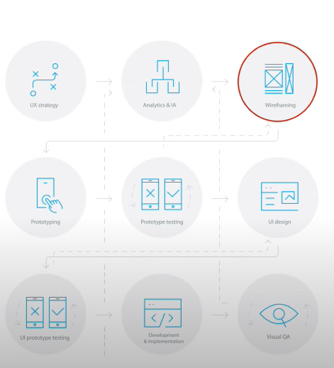
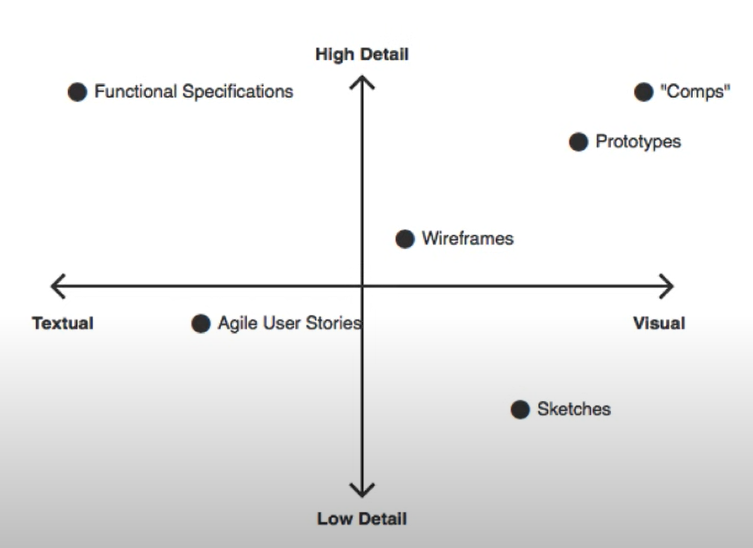

# Vocabulary
- Artifact
- Rough
- Discard
- Fidelity
- Convey: truyền tải
- Economical: Tiết kiệm
- Annotation
- Brief

# How Good Software Gets Make

1. Identify a problem
2. **Understand the problem** [UX]
3. Design a solution [UX]
4. **Plan and communicate the solution** [UX]
5. Build it

# Wireframe

- A wireframe is a schematic or other low-fidelity rendering of a computer interface
  - Primarily demonstrate 
    - Functionality
    - Features
    - Content
    - User flow 
  - -> without explicitly specifying the visual design of a product.

- Wireframes are meant to be used as rough representations of interface ideas that can be quickly discarded and iterated upon until design solutions are selected.

- Wireframes = design & communication artifacts 
- Designer uses for convey the most important information in the most economical way

## Defined by
- Mostly visual with some text / annotation
  - Not detail like Functional specification

- Limited use of color
  - Focus on usability + flow of the design

- Placeholder text & images
  - Not representative of the final product
  - It is early stage of process

- Low - Medium fidelity

- Limited interactivity (if any)
  - Don't show animated transitions, context menus, or other sophisticated interaction.

## 1. Ideation Phase

- This creative phase is where you generate as many ideas as possible in order to iterate toward better and better solution.
- Cứ nháp, nháp, .... đến khi nào ứng thì thôi
- Kết hợp vẽ đơn giản & note mô tả
  - Vẽ phải cực kì đơn gian và dễ hiểu
  - Mô tả chỉ để mô tả vẽ ý tưởng phức tạp chứ ko phải mô tả chi tiết
    - Workflow, event

1. Don't refine or dire too deep too quickly.
  - Get messy
  - Add, add, add
  - Subtract later
  - Try to work quick and dirty, but also include just enough detail to make sense of them when you review them later.
2. Don't judge your ideas before putting them on the page
  - Create first, reflect later.
  - Don't judge your ideas or think too much as you're working.
3. Practice working with different levels of detail until you find "just the right amount of detail, and no more"

## 2. Validation Phase

- Use your wireframes to communicate result of the ideation phase in order to gather feedback and learn from others.
- But don't let the wireframes speak for themselves.
  - Let them guide the story, allowing you to complete it.
- Wireframes allow you to show and tell the whole story.
- Tell a story about the problem be solving with this design > describing it in term of features.
- Add annotations as needed for later viewing and sharing

# Project brief

- A project brief is a short description of key elements of project. 
- A quick summary for project stakeholders and cross-functional collaborators. 
- Project brief should communicate project requirements
  - Without bogging stakeholders down with too many details.

- (!) Brief is based on what Stakeholders require
  - It doesn't have only 1 template.

## Project plan

1. Project goals [brief]
  - Background information
  - Project objectives

2. Success metrics [brief]

3. Stakeholders and roles
  - Target audience [brief]

4. Budget

5. Milestones and deliverables
  - Project scope [brief]

6. Timeline and schedule 
  - Master schedule [brief]

7. Project communication plan

8. Risk management plan

# Prototype

- Prototype is a realistic representation of the final product
- Prototypes are often used to test a product with representative users before committing to development
- Final checkpoint before development starts

- Useful for large-scale projects, take a very long time to build and are often overly-detailed
  - Agile and tightly-integrated in-house teams may not need to use prototypes at all.
## Wireframes != Prototype

### Wireframe
    - Used for communication & ideation
    - Fast & "cheap"
    - Rough
---------------------------------------------------------------------------------------------------------------------------------------------------
- A wireframe is like a blueprint.
- It serves multiple purposes and speaks to multiple audiences. 
- It provides the client with an understanding of what will be built and where things will be located, although it leaves some details to the imagination, such as the building materials and color of the walls.

### Prototype
- Used for presentation & selling
- Time-consuming & "expensive"
- Polished
---------------------------------------------------------------------------------------------------------------------------------------------------
- A prototype is more like a scale model of a building.
- It is a realistic representation of the project to be built, used for final approval.
- Where this analogy falls short is that building a house is necessarily a "waterfall" process, where each step occurs in sequence and is mostly "locked in" afterwards.
- The reason that prototypes are not always needed is that modern software processes aren't like this anymore; software can be built in smaller chucks and some decisions can be deferred until more information is available.

# Functional specification
- Functional specifications are the oldest and most traditional UI design artifacts.
- Mostly text
- Often very long & detailed
- Very few, if any, visuals

# Agile User Story